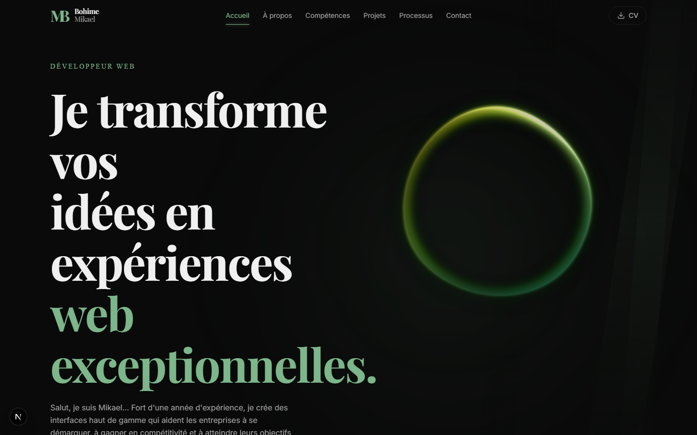
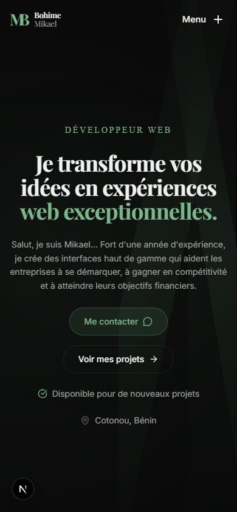
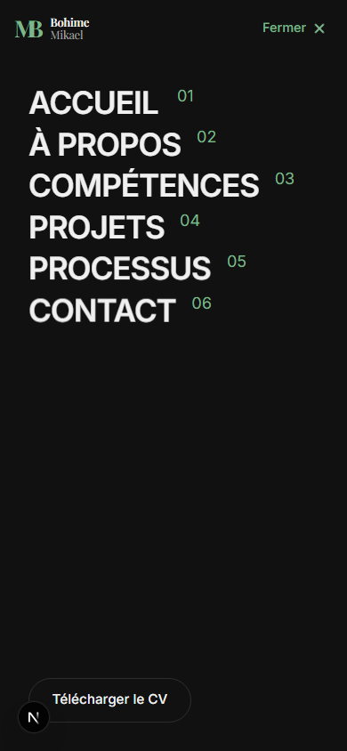
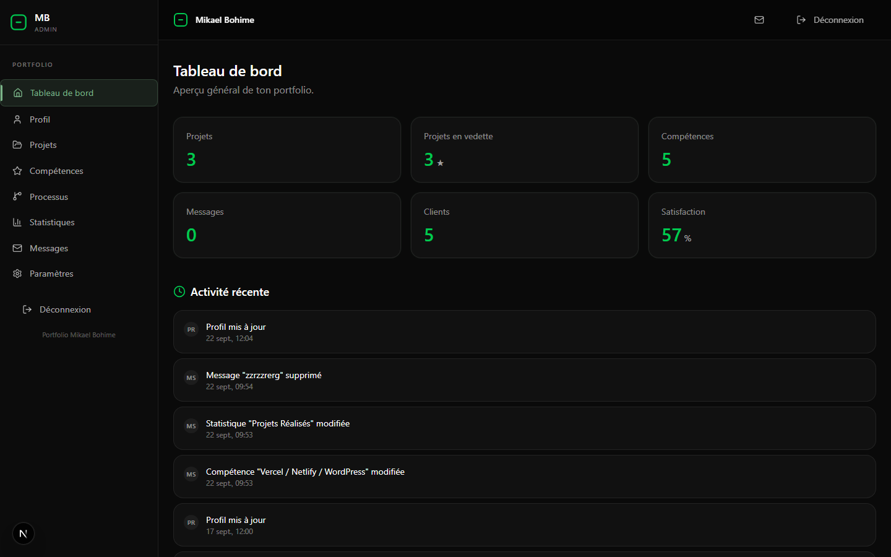

# 03 — Design system

## 1. Direction artistique
Portfolio premium, thème **sombre unique** (pas de mode clair) : fond quasi noir,
accent vert sauge, cartes en verre dépoli, typographie éditoriale serif pour les titres.
Zéro ombre portée colorée agressive : la profondeur vient du blur et des halos verts.

## 2. Tokens (`src/app/globals.css`, bloc `@theme inline`)
| Token | Valeur | Usage |
|---|---|---|
| `--color-background` | `#0a0a0a` | fond page |
| `--color-foreground` | `#f0f0f0` | texte principal |
| `--color-navy` / `--color-navy-light` | `#111111` / `#1a1a1a` | surfaces, images fallback |
| `--color-accent` / `--color-accent-bright` | `#7cb68a` / `#9dd4a8` | CTA, liens actifs, icônes, halos |
| `--color-text-secondary` / `--color-text-dim` | `#a0a0a0` / `#606060` | textes secondaires |
| `--color-border-subtle` | `rgba(255,255,255,0.08)` | bordures cartes |
| `--font-sans` | Inter, system-ui | corps de texte |
| `--font-serif` | Playfair Display, Georgia | titres (`font-editorial`), logo MB |
| `--font-mono` | Geist Mono, Fira Code | chiffres, eyebrow Hero |

Règles : arrondi standard `rounded-2xl`, sections `py-12 md:py-16`
(bandeau TechStack `py-4 md:py-6`), container `max-w-7xl px-4 md:px-6`.

## 3. Composants
| Composant | Fichier | Règle d'usage |
|---|---|---|
| Logo | `components/Logo.tsx` | Monogramme MB Playfair `#7cb68a` + nom empilé Bohime/Mikael ; `size="md"` header, `"sm"` footer |
| GlassCard | `components/GlassCard.tsx` | Fond `rgba(20,20,20,0.6)` + `blur(12px)` ; prop `glow` pour les mises en avant |
| Boutons | classes Tailwind | CTA primaire : pilule `bg-accent/10 border-accent/30 text-accent` ; secondaire : `border-border-subtle` ; submit : dégradé accent→bright, texte `#0a0a0a`, pleine largeur sur mobile |
| StatCard | `components/StatCard.tsx` | Halo `SpotlightCard` + compteur `useCountUp` (valeur exacte garantie) |
| ProjectCard | `components/ProjectCard.tsx` | Image 16:9 (`object-cover`, boutons 44px visibles au tactile) + bordure `ChromaGrid` + fallback dégradé+titre si fichier absent |
| SkillBar | `components/SkillBar.tsx` | Label + % + barre animée au scroll |
| Formulaire | `sections/Contact.tsx` | Champs `rounded-xl bg-surface/50`, carte entourée de `BorderGlow` (bordure conique rotative) |

Effets React Bits : BlurText (titre Hero), DecryptedText (rôle), TrueFocus (6 titres),
ScrollReveal (bio), Magnet/ClickSpark (CTA), LogoLoop (techs), StaggeredMenu (mobile),
Orb + Beams (fond Hero), TiltedCard (Processus desktop).

## 4. Captures de référence
| Vue | Fichier |
|---|---|
| Hero desktop | `captures/hero-desktop.png` |
| Page complète desktop | `captures/page-desktop.png` |
| Hero mobile | `captures/hero-mobile.png` |
| Page complète mobile | `captures/page-mobile.png` |
| Menu mobile ouvert | `captures/menu-mobile.png` |
| About / Projets / Stats / Contact | `captures/section-*-desktop.png` |
| Admin login / dashboard | `captures/admin-login.png`, `captures/admin-dashboard.png` |

